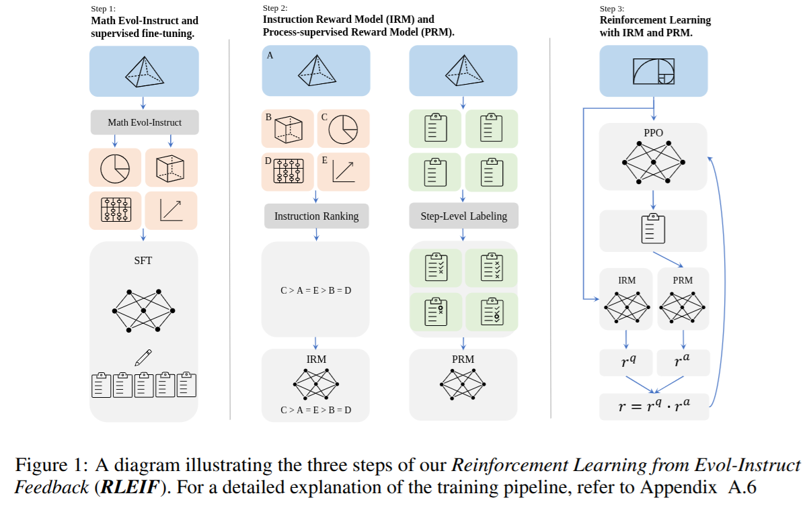
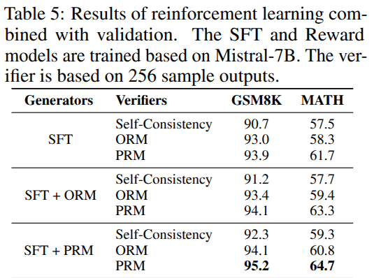
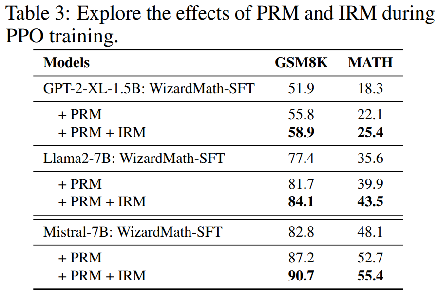
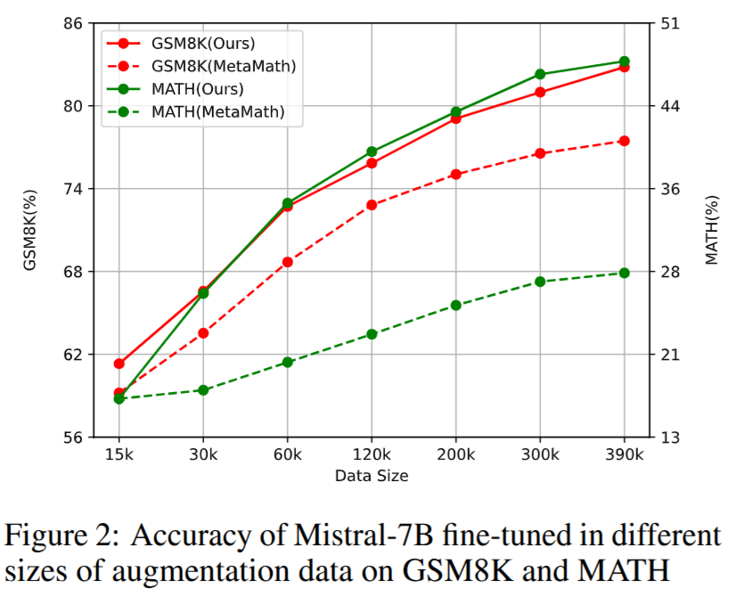
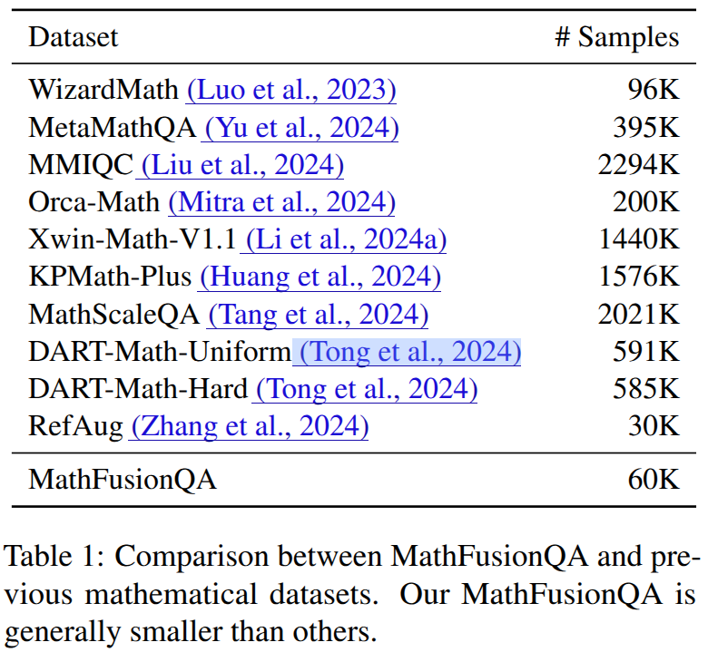
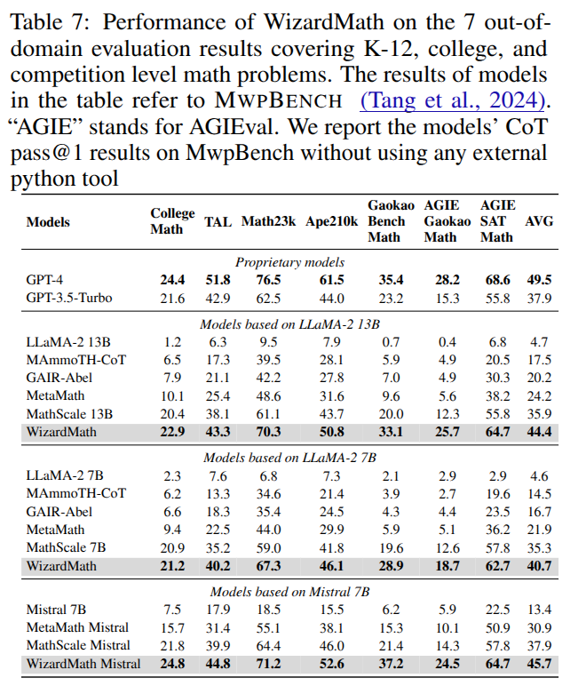
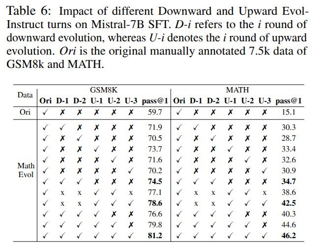
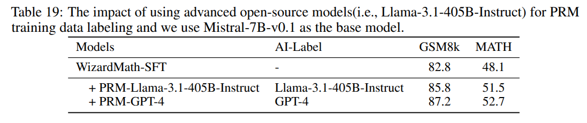
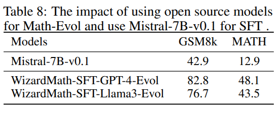
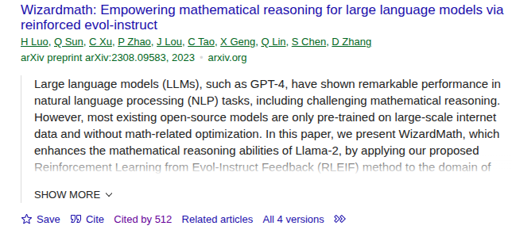

# WizardMath - Paper Review

- [Summary	2](#summary2)
- [Analysis Report	2](#analysisreport2)
- [1. Context	2](#1context2)
- [2. Technical Contributions and Innovations	3]- (#2technicalcontributionsandinnovations3)
- [2.1 Math Evol-Instruct: Diversified Synthetic Data Generation	5]- (#21mathevolinstructdiversifiedsyntheticdatageneration5)
- [2.2 Reinforcement Learning with Multi-Faceted Reward Models	5]- (#22reinforcementlearningwithmultifacetedrewardmodels5)
- [2.3 Automated and Scalable Data Labeling	6]- (#23automatedandscalabledatalabeling6)
- [3. Empirical Findings and Industry Impact	6]- (#3empiricalfindingsandindustryimpact6)
- [3.1 State-of-the-Art Results	6](#31stateoftheartresults6)
- [3.2 Cross-Model Generalization	7](#32crossmodelgeneralization7)
- [3.3 Ablation and Analysis	8](#33ablationandanalysis8)
- [4. Position in the Academic and Industrial Landscape	9]- (#4positionintheacademicandindustriallandscape9)
- [4.1 Advancing Open-Source LLM Capabilities	9]- (#41advancingopensourcellmcapabilities9)
- [4.2 Impact on AI in Education, Scientific Computing, and Engineering	9]- (#42impactonaiineducationscientificcomputingandengineering9)
- [4.3 Broader Trends and Insights	9](#43broadertrendsandinsights9)
- [5. Strengths, Limitations, and Outlook	10]- (#5strengthslimitationsandoutlook10)
- [5.1 Strengths	10](#51strengths10)
- [5.2 Limitations	10](#52limitations10)
- [6. Conclusion	10](#6conclusion10)
- [References	11](#references11)
- [Appendix	11](#appendix11)
- [A1. Google Scholar Analysis	11](#a1googlescholaranalysis11)
- [A2. Reviews Summarization	12](#a2reviewssummarization12)

# Summary

- Link: [https://wizardlm.github.io/WizardMath](https://wizardlm.github.io/WizardMath)
- HF: [https://huggingface.co/WizardLMTeam/WizardMath-70B-V1.0](https://huggingface.co/WizardLMTeam/WizardMath-70B-V1.0)
- Code: [https://github.com/nlpxucan/WizardLM/tree/main/WizardMath](https://github.com/nlpxucan/WizardLM/tree/main/WizardMath) 
- Reviews at ICLR’25: [https://openreview.net/forum?id=mMPMHWOdOy](https://openreview.net/forum?id=mMPMHWOdOy)

**WizardMath** represents one of the most significant efforts in advancing the mathematical reasoning capabilities of large language models (LLMs). While proprietary models, such as GPT-4, have demonstrated strong performance across various natural language tasks, including mathematics, most open-source LLMs have lagged, particularly in complex, multistep quantitative reasoning tasks.

This paper directly addresses that gap by introducing a comprehensive framework—**Reinforcement Learning from Evol-Instruct Feedback (RLEIF)**—which boosts both performance and data efficiency for mathematical problem-solving, primarily focusing on freely available model families like Llama and Mistral. \
The Evol-Instruct method was introduced in the WizardLM approach, and the authors extended it to the mathematical domain. They created a robust mathematical supervised fine-tuning (SFT) dataset. The introduction of new reward models—combining an Instruction Reward Model (IRM) and Process Reward Model (PRM)—for reinforcement learning in mathematics improves performance in the experiments.

WizardMath Mistral 7B outperforms existing open-source models. The experimental results show the effectiveness of different model sizes (number of billion parameters) and WizardMath 70B even exceeds proprietary models, those as strong proprietary models such as GPT-3.5-Turbo, Claude 2, Gemini Pro, and GPT-4-early-version. \
It should be noted that open-source models are usually (except Llama or DeepSeekMath) not necessarily pre-trained on mathematical datasets, and how proprietary models are trained is a secret or only partially disclosed. Further, in the result Table 1 (see [1]), it should be considered that WizardMath is a model trained with both SFT and reinforcement learning (RL), whereas typically other models are not fine-tuned via RL. It would be interesting to see how the other models might also benefit comparably from RL for a more insightful evaluation. Moreover, WizardMath relies on the proprietary GPT-4 model for PRM, which makes it challenging to fully agree with the authors' characterization of WizardMath as a fair comparison to open-source models.

While not explicitly stated in the paper, recent trends include the use of WizardMath to enhance agentic AI, enabling autonomous problem-solving and decision-making in complex environments. This aligns with industries requiring verifiable, step-by-step reasoning for high-stakes decisions, driving progress in fields like robotics and scientific research.

In summary, WizardMath is a milestone for open-source mathematical LLMs, demonstrating that process-supervised RL with diversified, AI-evolved math data can vault open models into (and beyond) the realm previously dominated by closed, expensive alternatives.

# Analysis Report

## 1. Context

Large-scale language models (LLMs) have gained considerable attention and become the preferred solution for a wide range of natural language processing (NLP) tasks, such as open-domain conversations, coding, and mathematics.

LLMs are typically pre-trained on vast amounts of internet data and then fine-tuned using specialized instruction data and techniques. This approach enables them to achieve cutting-edge zero-shot performance across multiple benchmarks.

This trend also gradually stimulates the releases of open-source models (Mistral, Alpaca, Vicuna, WizardLM [2]).

Closed-source models, like those developed by OpenAI, often perform better in complex, multi-step reasoning tasks due to their more specialized training, optimizations, and proprietary techniques [3]. They tend to have access to more tailored datasets and advanced methods for fine-tuning, which can enhance their performance in areas like multi-step mathematical and scientific reasoning [3,4].

The authors emphasize that they excluded external Python tools (such as ToRA [5], MAmmoTH [6], or OpenMathInstruct-2 [7]) from their research. ToRA, for example, focuses not only on Chain-of-Thought (CoT) reasoning [5], but also on a system with Agentic AI, where tools are provided to enhance reasoning. In contrast, WizardMath's contribution is centered on the reasoning process itself, rather than on the system.

In 2024, ToRA published its results and is outperforming the WizardMath results from the arXiv version of 2023:

*Notably, TORA-7B reaches 44.6% on the competition-level dataset MATH, surpassing the best open-source model WizardMath-70B by 22% absolute. TORACODE-34B is also the first open-source model that achieves an accuracy exceeding 50% on MATH, which significantly outperforms GPT-4’s CoT result, and is competitive with GPT-4 solving problems with programs.*

There is no direct comparison of the current WizardMath publication and ToRA, which makes the impression that WizardMath won’t be able to at the moment. WizardMath explicitly writes that they only outperform GPT-4 earlier versions.

## 2. Technical Contributions and Innovations

In this section, we will discuss the evol-instruct, reinforcement learning, and automated and scalable approach.

Note: In Appendix A2 - remarks by the reviewers:  \
*While the empirical results are strong, some reviewers see the novelty as moderate because both the Evol-Instruct framework and PRM methodology existed previously—the paper “basically took Evol-Instruct and PRM and used them to train a model”.*

In Figure 1 (copied from [1]), the 3 steps of the WizardMath method are illustrated.

As illustrated in Figure 1, the authors propose a novel method called Reinforcement Learning from Evol-Instruct Feedback (RLEIF). This approach aims to generate diverse math instruction data through a newly introduced framework, Math Evol-Instruct, which incorporates both downward and upward evolution processes. The downward evolution generates grade school math problems, while the upward evolution tackles more challenging high school-level math. (More in Section 2.1)

In contrast to WizardLM [2] and WizardCoder [8], which primarily focus on the Supervised Fine-Tuning (SFT) stage and are prone to learning hallucinated information from the teacher model, the authors of this study introduce the innovative use of a Process-Reward Model (PRM). This model addresses the issue of false positives that can arise during the problem-solving process.

To prevent the instruction evolution from becoming uncontrollable, the authors also introduce an Instruction Reward Model (IRM). The IRM is designed to evaluate the quality of the evolved instructions, while the PRM provides feedback on each reasoning step during the solution process. These two reward models are trained using existing research [9-12]. (More in Section 2.2)

The training process begins by fine-tuning large language models (LLMs) with the evolved math data. Subsequently, GPT-4 is employed to produce a ranking order of the instructions and assess the correctness of each reasoning step. The LLMs are then optimized to incorporate this feedback into the reward models. Finally, a Step-by-Step Proximal Policy Optimization (PPO) [13] approach is used to train the model, WizardMath, ensuring it adapts to the evolving instructions while maintaining accuracy.

## 2.1 Math Evol-Instruct: Diversified Synthetic Data Generation

- The **Evol-Instruct** [1, 2] methodology employs upward and downward evolution to create diverse and complex math problems.

- **Upward Evolution** increases the complexity and constraints of existing problems, leading to more challenging questions.

- **Downward Evolution** (a novel addition) simplifies problems, creating easier variants. This complements the upward approach, providing a controllable span of complexity, simulating a real educational curriculum from basic to advanced challenges.

- **Significance:** This approach automates large-scale, high-quality, diverse instruction data creation, a crucial factor for training models to generalize to unfamiliar or harder tasks—a recognized bottleneck in LM development.

- **Weakness**: 

- In the related work, there could have been a discussion of an alternative, such as [15], where smaller LLMs can be used for instruction evolving.

- Only GPT-4 is used for Evol-Instruct, which is known for advanced reasoning abilities. It is a bit questionable if the authors can state it as an open-source approach and comparison is correct.

## 2.2 Reinforcement Learning with Multi-Faceted Reward Models

- RLEIF harmonizes two reward models:

- **Instruction Reward Model (IRM):** Automatically assesses the *quality* of instructions regarding clarity, completeness, and difficulty. IRM is trained on the rankings provided by GPT-4. 

- **Process-supervised Reward Model (PRM) **[9]**:** Judges the *correctness* of each reasoning step in model-generated solutions, trained with step-level feedback (also GPT-4-labeled). (see Tables 4 and 5)

- **Role:** Unlike previous outcome-only reward models, PRM ensures the model does not learn to “game” the metric by producing correct answers via erroneous steps (the “false positive” problem). Both IRM and PRM improve RL alignment, leading to more reliable intermediate reasoning:

- **Significance:** This step-by-step, process-focused alignment is rapidly becoming a technical frontier, moving beyond “does it get the final answer?” to “does it reason correctly, as a human would be expected to?”

- **Weakness:** 

- Proprietary GPT-4 is used.

## 2.3 Automated and Scalable Data Labeling

By leveraging proprietary model GPT-4 for both problem evolution and annotation, the pipeline achieves full automation and scalability, avoiding costly and inconsistent manual data curation. This is especially important for math, where high-quality annotation requires significant expertise.

## 3. Empirical Findings and Industry Impact

## 3.1 State-of-the-Art Results

- **WizardMath**, particularly the 70B scale models, routinely beats the best open-source alternatives (like MetaMath, MathScale, and Xwin-Math) and even previous iterations of the most popular proprietary LLMs (like GPT-3.5 and GPT-4-early) on the GSM8k and MATH benchmarks, which cover everything from elementary school math to difficult high school math. (see Table 1 in [1]) \

- **Data Efficiency:** 

- WizardMath achieves higher accuracy with less synthesized data than major competitors. The evolutionary method is shown to produce more “efficient” data—learning curves demonstrate higher accuracy at a smaller data scale compared to other synthesis methods:

- MathFusion [16] is a later approach that needs fewer samples than WizardMath (version 2023, no comparison with version 2025). More investigation in this direction for data efficiency is recommended:

## 3.2 Cross-Model Generalization

- RLEIF’s improvements are robust across several backbone architectures (GPT-2, Llama, Mistral, Qwen, DeepSeek), demonstrating general applicability, not just model-specific tuning.

- **Out-of-domain Generalization:** WizardMath exhibits strong performance on OOD datasets (e.g., MWPBench), indicating better “real-world” applicability.

## 3.3 Ablation and Analysis

- Both **downward and upward evolution** make significant, complementary contributions to performance.

- Process supervision (PRM) and instruction quality assessment (IRM) together provide substantive RL improvements over SFT alone or SFT+RL with only one reward model.

- PRM labeled purely by open-source models (e.g., Llama) still achieves strong results, suggesting cost-effective alternatives to GPT-4 for future scaling.

## 4. Position in the Academic and Industrial Landscape

## 4.1 Advancing Open-Source LLM Capabilities

- The gap between proprietary (closed) and open-source models has had serious real-world implications for democratizing advanced AI capabilities. WizardMath provides a clear path to bridge this gap, particularly in quantitative and STEM domains, historically open-source LLMs’ achilles heel.

## 4.2 Impact on AI in Education, Scientific Computing, and Engineering

- High-quality mathematical reasoning unlocks applications in:

- **Education:** Personalized, adaptive tutoring and automated grading.

- **Scientific Research:** Automated theorem proving, scientific literature understanding.

- **Engineering:** Automated verification, technical documentation, and modeling assistance.

## 4.3 Broader Trends and Insights

- The “process supervision” trend aligns with how high-stakes industries (finance, healthcare, law) require not just answers but verified, auditable, stepwise logic—WizardMath directly answers this need.

- The automatic, AI-driven data synthesis and reward labeling pipeline foreshadows even greater scaling and adaptation to new subdomains (e.g., physics, chemistry) as public LLMs become increasingly capable.

- Agentic reasoning: WizardMath’s advanced mathematical reasoning, combined with reinforcement learning, enhances agentic AI by enabling autonomous problem-solving and decision-making in complex environments. As AI agents become more capable, they will be able to adapt, optimize, and model real-world scenarios with greater efficiency, driving progress in fields like robotics, scientific research, and AI-driven innovation. This aligns with broader trends in industries requiring not only accurate answers but also verifiable, step-by-step reasoning to ensure reliable, high-stakes decision-making.

## 5. Strengths, Limitations, and Outlook

## 5.1 Strengths

- **Unified, robust training pipeline:** From data synthesis to multi-level RL rewards—all modular, scalable, and largely automated.

- **Significant, well-documented gains:** Comprehensive benchmarking across multiple datasets and model backbones.

- **Ablation and contamination control**: The study carefully looks at leakage, duplication, and simple connections.

## 5.2 Limitations

- Heavy reliance on GPT-4 for initial data evolution and annotation, though partially mitigated by later open-source experiments.

- Focus is primarily on core mathematical reasoning—extension to truly symbolic logic (full theorem proving, proof assistants) is not covered.

- Some reliance on synthetic data means caution must be used when deploying in areas requiring deeper domain knowledge (university-level, research mathematics), though early generalization results are promising.

- Multimodality. This approach can be easily extended to multimodality. Evol-Instruct has already shown capable results [14].

## 6. Conclusion

WizardMath represents a significant advancement in the domain of open-source mathematical large language models (LLMs). It illustrates that process-supervised reinforcement learning (RL) combined with a diverse, AI-generated mathematical data set can propel open models to achieve, and even exceed, the performance levels traditionally seen in closed, highly costly alternatives. Its exceptional performance across core benchmarks and generalization tasks, alongside a robust and scalable training pipeline, underscores both novel scientific insights and technical expertise, thereby setting a new benchmark within the field.

In the rapidly evolving AI landscape, the framework introduced by WizardMath not only pushes the boundaries of the current state-of-the-art but also establishes critical paradigms—such as process-based supervision, data-driven evolution, and automated reward modeling. These are poised to serve as foundational elements for future developments in language, mathematics, and broader scientific disciplines.

# References

[1] WizardMath: [https://openreview.net/forum?id=mMPMHWOdOy](https://openreview.net/forum?id=mMPMHWOdOy) \
[2] WizardLM: [https://arxiv.org/abs/2304.12244](https://arxiv.org/abs/2304.12244)  \
[3] LLM Math Reasoning - Progresses and challenges: [https://arxiv.org/pdf/2402.00157](https://arxiv.org/pdf/2402.00157)  \
[4] On LLMs-Driven Synthetic Data Generation, Curation, and Evaluation: A Survey [https://arxiv.org/pdf/2406.15126](https://arxiv.org/pdf/2406.15126) \
[5] ToRA  [https://github.com/microsoft/ToRA](https://github.com/microsoft/ToRA) \
[6] MAmmoth [https://tiger-ai-lab.github.io/MAmmoTH](https://tiger-ai-lab.github.io/MAmmoTH)  \
[7] OpenMathInstruct-2 [https://arxiv.org/abs/2410.01560](https://arxiv.org/abs/2410.01560) \
[8] WizardCoder [https://wizardlm.github.io/WizardCoder](https://wizardlm.github.io/WizardCoder)  \
[9] Let’s verify step by step  [https://openreview.net/pdf?id=v8L0pN6EOi](https://openreview.net/pdf?id=v8L0pN6EOi)  \
[10] Solving math word problems with process- and outcome-based feedback [https://arxiv.org/abs/2211.14275](https://arxiv.org/abs/2211.14275)  \
[11] Math-Shepherd  [https://arxiv.org/abs/2312.08935](https://arxiv.org/abs/2312.08935)  \
[12] Common 7B Language Models Already Possess Strong Math Capabilities [https://arxiv.org/pdf/2403.04706](https://arxiv.org/pdf/2403.04706)  \
[13] PPO [https://docs.pytorch.org/tutorials/intermediate/reinforcement_ppo.html](https://docs.pytorch.org/tutorials/intermediate/reinforcement_ppo.html)  \
[14] MMEVOL [https://aclanthology.org/2025.findings-acl.1009](https://aclanthology.org/2025.findings-acl.1009)  \
[15] Smaller Language Models Are Better Instruction Evolvers [https://arxiv.org/pdf/2412.11231v1](https://arxiv.org/pdf/2412.11231v1)  \
[16] Mathfusion [https://arxiv.org/abs/2503.16212](https://arxiv.org/abs/2503.16212) 

# Appendix

## A1. Google Scholar Analysis

The first version of this paper appeared on arXiv in 2023. Today, it has been cited around 512 times.

Cited by: [scholar.google.com/scholar?cites=9916633631554786614&as_sdt=2005&sciodt=0,5&hl=en](https://scholar.google.com/scholar?cites=9916633631554786614&as_sdt=2005&sciodt=0,5&hl=en) 

When clicking on the recent papers in “cited by”, it can be observed that affiliations are at top-tier research institutes and industry. The mix of both implies the practical importance of this paper. Here are some examples copied from “cited by”:

- [https://arxiv.org/pdf/2504.09037](https://arxiv.org/pdf/2504.09037) (Salesforce, NUS, NTU)

- [https://arxiv.org/pdf/2501.17703](https://arxiv.org/pdf/2501.17703) (Department of Computer Science, University of Waterloo, CMU, Vector Institute)

- [https://arxiv.org/pdf/2506.09038](https://arxiv.org/pdf/2506.09038) (FAIR Meta)

- [https://arxiv.org/pdf/2503.02324](https://arxiv.org/pdf/2503.02324)  (University of Hong Kong, Ant Group)

- [https://aclanthology.org/2025.acl-long.42.pdf](https://aclanthology.org/2025.acl-long.42.pdf) (Tsinghua University, New York University, Tencent)

In a broader sense, Wizardmath is interesting for LLM reasoning that enables logical inference, problem-solving, and decision-making. From the system's point of view, it is an integral part of agentic AI[^1] .

## A2. Reviews Summarization

The reviews of "WizardMath: Empowering Mathematical Reasoning for Large Language Models via Reinforced Evol-Instruct" highlight both substantial strengths and notable weaknesses in the work.

**What reviewers found good:**

- **Strong empirical results:** Reviewers consistently praised the paper for achieving impressive gains in mathematical reasoning, often exceeding those of strong proprietary models such as GPT-4 and Claude2. One reviewer noted that improvements from training on Math Evol-Instruct were “more than 10 points,” and that surpassing proprietary models is significant and attention-worthy. \

- **Thorough experiments and ablations:** The paper presents exhaustive experiments over a wide range of model scales (from 100M to 70B parameters), using different base models, and compares against several math-specific baselines. The ablation studies and analyses are seen as solid evidence of the method’s advantages and scalability. \

- **Novel methodological components:** The introduction of new reward models—an Instruction Reward Model (IRM) and Process Reward Model (PRM)—for reinforcement learning in mathematics is considered a valuable innovation. Experimentally, integrating IRM with PRM is shown to robustly improve performance. \

- **Scalability and automation:** The model training pipeline is largely automated using AI, including fully automated instruction evolution and reward data generation, which reviewers noted as a scalable and adaptable feature that could potentially be applied beyond math (e.g., in coding domains). \

- **Clear practical impact:** The experiments demonstrate consistent, robust improvements over open and closed alternatives, which reviewers interpret as deliverable value to the NLP and AI research community. \

**What reviewers found bad or problematic:**

- **Unfair baseline comparisons:** Multiple reviewers criticized the fairness of comparisons in the results tables. Specifically, WizardMath is a model trained with both supervised fine-tuning (SFT) and reinforcement learning (RL), whereas many baselines have only undergone SFT. They argue that other models might also benefit comparably from RL, and comparisons should be more rigorously controlled, isolating the effects of SFT and RL. \

- **Reliance on GPT-4 labeling for PRM:** Some concerns using GPT-4 for annotating process reward model (PRM) training data may not scale well to much larger datasets and could limit generalizability, though reviewers acknowledge that this enables full automation and seems effective in practice. \

- **Presentation and clarity:** The presentation was described as “messy” and at times unclear. Some technical terms and methodological concepts, like "Evol-Instruct", were referenced before explanation, certain dataset descriptions (like grade school vs high school tasks) appeared and disappeared without clear discussion, and main tables (such as Table 1) omitted important baseline scores. There were also typos and confusing figures (e.g., Figure 1). \

- **Marginality of contribution:** While the empirical results are strong, some reviewers see the novelty as moderate because both the Evol-Instruct framework and PRM methodology existed previously—the paper “basically took Evol-Instruct and PRM and used them to train a model”. They suggest a broader contribution could be achieved by applying the method to additional domains (such as code). \

- **Reporting gaps:** Reviewers noted that some performance information, such as base model scores for certain variants, is missing from the tables, making it difficult to appreciate the incremental gains attributable to the proposed method. \

**Other notes:**

- The authors, in their responses, elaborated on these points, providing clarification, improved explanations, and expanded ablation studies to address review concerns. They also showed openness to expanding their comparisons and clarifying their figures and methodology in future versions.

In summary, the paper is recognized for its strong empirical performance, especially in surpassing major baselines and proprietary models, and for its scalable, automated approach using new reward models. The main criticisms center on comparative rigor, clarity/presentation, and perceived marginality in core methodological novelty.

## Notes

[^1]:  https://en.wikipedia.org/wiki/Agentic_AI 